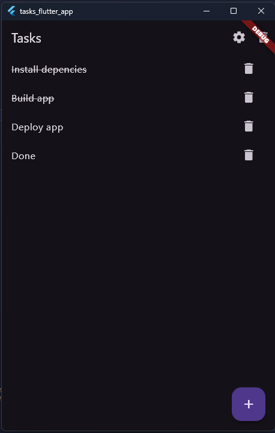
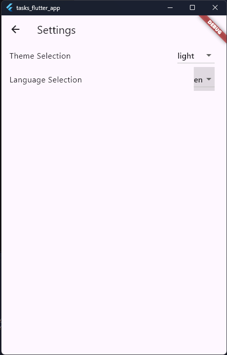
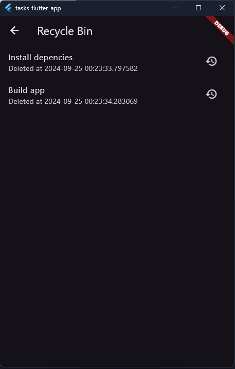

# Tasks app
Android, IOS, Windows, Linux, MacOS tasks app

# Installing depencies
```bash
flutter pub get
```

# Build app
```bash
flutter build YOUR_PLATFORM
```

<details>
<summary>Screenshots</summary>





</details>
